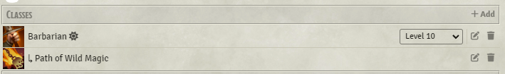
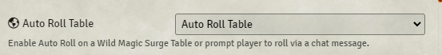
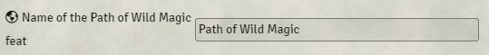
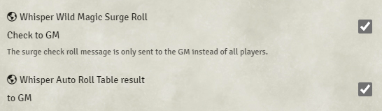

# Path of Wild Magic Barbarian Setup

This setup will roll on a Wild Magic Surge table every time a Path of Wild Magic Barbarian goes into a Rage.

1. Ensure you have the subclass `Path of Wild Magic` set on the character like this screen shot.

2. In the module settings, ensure you have `Auto Roll Table` set to the option `Auto Roll Table` or `Player Trigger Roll`. If this is set to `None` then nothing will happen.

3. Set the name of the Roll Table for the Wild Magic Surge to roll on

4. If you don't want the players to see the roll messages you can set the following in settings so that only you can see it

