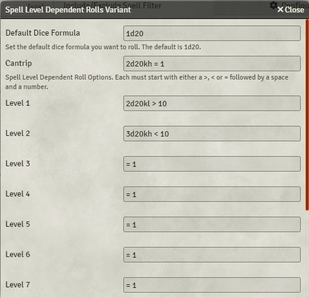

# Spell Level Dependent Rolls

Adds the ability to set your own roll evaluation dependent on the cast spell level.

For the example image below it would

- On a `Cantrip` spell cast: Roll 2 D20's with `Advantage` and if equal to `1`, cause a `Wild Magic Surge`
- On a `Level 1` spell cast: Roll 2 D20's with `Diadvantage` and if greater than `10`, cause a `Wild Magic Surge`
- On a `Level 2` spell cast: Roll 3 D20's with `Advantage` and if less than `10`, cause a `Wild Magic Surge`
- If any other spell is cast, roll 1 D20 based on the `Default Dice Formula` and if is equal to `1`, cause a `Wild Magic Surge`

Special thanks to [Jackolas126](https://github.com/Jackolas126) and [linxcat](https://github.com/linxcat) for this suggestion.

